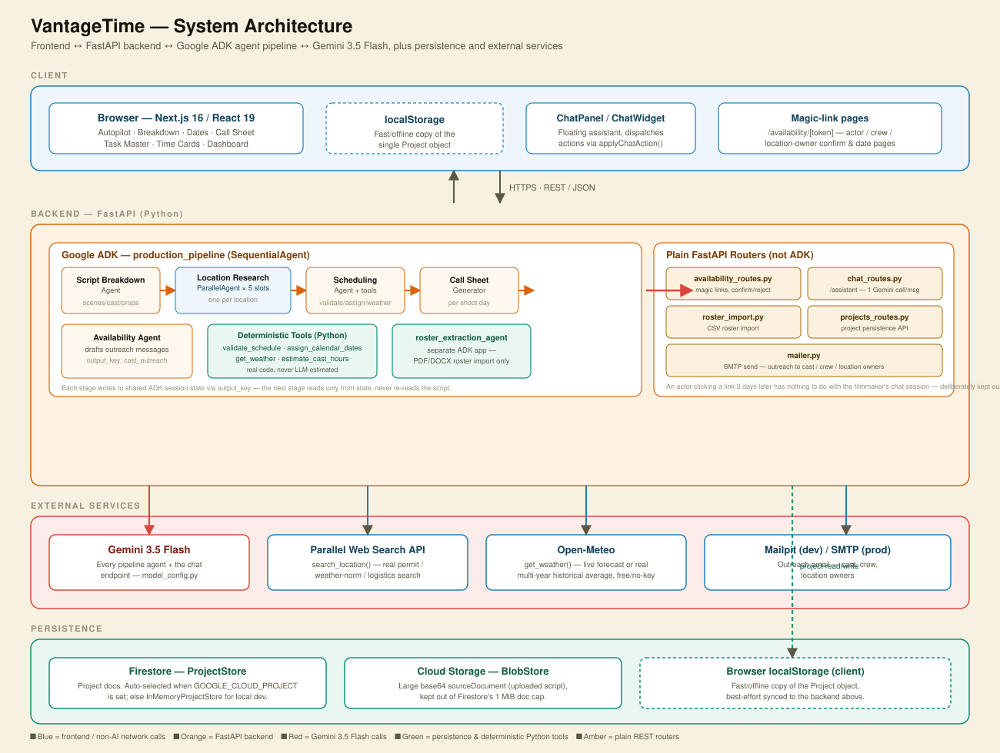

# VantageTime — Developer Overview

*Internal developer handoff. A script-to-schedule-to-call-sheet AI tool for indie filmmakers, YouTubers, and film students — the radically cheaper, mobile-first alternative to StudioBinder / Filmustage / Yamdu / Celtx. Upload a script; get a scene breakdown, a validated shoot schedule, real location research, a call sheet, and a full cast/crew confirmation loop — coordinated by a real multi-agent pipeline, not a single prompt with a form bolted on.*

## Contents

1. [Vision](#1-vision)
2. [Tech Stack](#2-tech-stack)
3. [Architecture Diagram](#3-architecture-diagram)
4. [Architecture — The Agent Pipeline](#4-architecture--the-agent-pipeline)
5. [Data Flow](#5-data-flow)
6. [Data Model](#6-data-model)
7. [Tab-by-Tab Tour](#7-tab-by-tab-tour)
8. [Deterministic vs. LLM](#8-deterministic-vs-llm--the-core-design-rule)
9. [Codebase Map](#9-codebase-map)
10. [Local Setup](#10-local-setup)
11. [Known Gaps](#11-known-gaps)

---

## 1. Vision

Tools like StudioBinder, Filmustage, Yamdu, and Celtx are built for productions with a line producer, a UPM, and a budget line for software. VantageTime targets the audience those tools ignore: a solo filmmaker, a two-person crew, a film-school short, a YouTube narrative shoot — someone who needs the same coordination problem solved (who's free, where can we shoot, what does day 3 look like) but has neither the budget nor the time to learn enterprise production-management software.

The bet is that most of what a line producer does by hand — breaking down a script into scenes, grouping scenes into shootable days, checking that nobody's double-booked, chasing cast for their availability, building a call sheet — is mechanical enough to automate end-to-end, as long as the arithmetic is done by real code and the AI is only asked to do what AI is actually good at: reading unstructured text (a script PDF, a location's web presence) and turning it into structured decisions.

**Autopilot as the spine.** Rather than nine independent tabs a user has to figure out on their own, one guided flow — Autopilot — walks them through the whole production in order, surfacing exactly what's blocking each step and letting them fix it inline without leaving the flow.

**Never guess, always report.** Every agent that touches a number (schedule feasibility, cast hours, dates, weather) hands off to deterministic Python and reports that tool's output verbatim. If a tool can't answer, the UI shows a real "needs review" state — never a plausible-sounding fabrication.

**Built for one person.** No roles, no permissions, no seat licensing. A single filmmaker owns the whole project: script to schedule to call sheet to payroll, in one continuous surface, at a price point (target ~$10/mo) that makes sense for a $2,000 short film, not a $2M feature.

Built for Google's All Things Agentic Hackathon (Taskmaster category) — see `PLAN.md` in the repo root for the original build plan and agent-architecture sketch this shipped implementation grew from, and `docs/DEVPOST_SUBMISSION.md` for the hackathon submission text.

---

## 2. Tech Stack

**Frontend:** Next.js 16.3.0 (App Router), React 19.2.8, TypeScript 5, Tailwind CSS v4. No component library, no state-management library — a single `Project` object typed in `lib/types.ts` holds all project state; React state + `localStorage` is the whole persistence layer client-side. Native HTML5 drag-and-drop for the Stripboard (no DnD library). Native `@media print` stylesheets for printable views (Call Sheet, Availability report, DOOD).

**Backend:** FastAPI, Google ADK (`google-adk`), Gemini 3.5 Flash, Python. Google's Agent Development Kit provides the `SequentialAgent` / `ParallelAgent` / `Agent` primitives and session/state plumbing. Every agent in the pipeline runs the same model, `gemini-3.5-flash`, configured centrally in `backend/common/model_config.py`.

**External integrations:** Parallel Web Search API (`PARALLEL_API_KEY`) powers real web search for location permit/logistics research. Open-Meteo (free, no key) supplies geocoding plus live forecast or genuine multi-year historical averages for `get_weather`. Mailpit is a local SMTP catcher in dev (`MAILPIT_HOST` / `MAILPIT_PORT`) standing in for a real transactional-email provider in production, used for outreach to cast/crew/location owners.

**Persistence:** A `ProjectStore` protocol backs project documents with either `InMemoryProjectStore` (default, dev) or `FirestoreProjectStore`, auto-selected by the presence of `GOOGLE_CLOUD_PROJECT`. The large base64 `sourceDocument` field (the originally uploaded script) is kept out of Firestore's 1 MiB document cap via a matching `BlobStore` (`LocalBlobStore` / `GCSBlobStore`). Client-side, every project also lives in `localStorage` as the fast/offline copy, best-effort synced to the backend.

---

## 3. Architecture Diagram

How the frontend, backend, Gemini, and persistence layers connect:



Read top to bottom: the browser talks to FastAPI over REST/JSON; FastAPI's ADK agent pipeline calls Gemini 3.5 Flash at every stage (red arrow) and fans out to Parallel Web Search / Open-Meteo / Mailpit for real external data (blue arrows); the backend reads and writes project state to Firestore and large files to Cloud Storage (green, dashed); the browser additionally keeps its own `localStorage` cache of the same project object.

If your viewer doesn't render the SVG inline, open `architecture-diagram.svg` directly — it's a standalone file in the same folder as this document.

### Text-form summary (same architecture, no image)

```
Browser (Next.js/React)  <── HTTPS / REST JSON ──>  FastAPI backend
                                                          │
                       ┌──────────────────────────────────┴───────────────────────────────┐
                       │                                                                    │
              Google ADK pipeline                                              Plain FastAPI routers
     (SequentialAgent: Breakdown → Location                                (availability, chat, roster,
      Research[∥×5] → Scheduling → Call Sheet                                projects, mailer — NOT ADK)
      → Availability)                                                                    │
                       │                                                                    │
        ┌──────────────┼──────────────────┐                                                 │
        │              │                  │                                                 │
   Gemini 3.5      Deterministic      Parallel Web                                     Mailpit / SMTP
     Flash          Python tools     Search API (location                            (outreach email)
 (every agent      (validate_schedule,   research)
   stage, plus    assign_calendar_dates,
  /assistant       get_weather →
     chat)          Open-Meteo,
                   estimate_cast_hours)
                                                          │
                                    ┌─────────────────────┴─────────────────────┐
                                    │                                           │
                              Firestore                                  Cloud Storage
                          (ProjectStore — project                     (BlobStore — large
                           docs; falls back to                       base64 source documents,
                           in-memory without                          kept out of Firestore's
                           GOOGLE_CLOUD_PROJECT)                            1 MiB cap)

Browser also keeps its own localStorage copy of the Project object, synced best-effort to the backend above.
```

---

## 4. Architecture — The Agent Pipeline

The core of the backend is one ADK `SequentialAgent`, `production_pipeline` (`backend/common/agents.py`), run once per uploaded script. Each stage writes its output to shared ADK session state under a fixed key (`output_key`), and the next stage reads only from that state — no stage re-reads the original script.

| Stage | Agent | What it does |
|---|---|---|
| 1 | **Script Breakdown Agent** | Reads the script PDF natively (Gemini multimodal, no OCR). Extracts scenes, cast, props, locations into structured JSON. `output_key="breakdown"` |
| 2 | **Location Research Pipeline** (`ParallelAgent`) | Up to `LOCATION_SLOTS = 5` `location_research_agent_N` instances run concurrently, one per distinct script location, each firing `search_location()` against the Parallel Web API for permits, weather norms, and logistics. |
| 3 | **Scheduling Agent** | Proposes shoot order + day groupings, then hands off to deterministic tools: `validate_schedule`, `assign_calendar_dates`, `get_weather`, `estimate_cast_hours`. `output_key="schedule"` |
| 4 | **Call Sheet Generator** | Synthesizes breakdown + validated schedule + location research into one call sheet per shoot day. Flags gaps instead of inventing facts. `output_key="call_sheets"` |
| 5 | **Availability Agent** | Drafts a personal outreach message per cast member with their real scheduled days/dates/hours. Drafting only — tokens, links, and response tracking are deterministic backend code. `output_key="cast_outreach"` |

**Separate, non-sequential agent:** `roster_extraction_agent` is its own ADK app, used only on the alternate "I already have production data" entry path — extracting a cast/crew roster from an uploaded PDF/DOCX rather than a script. It never runs as part of `production_pipeline`.

**What's *not* an ADK agent.** Everything after the pipeline finishes is plain deterministic FastAPI, on purpose — an actor clicking a magic link three days later has nothing to do with the filmmaker's original chat session:

| Router | Responsibility |
|---|---|
| `availability_routes.py` | Actor/crew/location magic-link pages: candidate-date submission, confirm/reject, priority ladder, conflict detection. |
| `chat_routes.py` | The floating chat assistant — a single Gemini call per message with a project-state snapshot and a fixed callable-action schema (not an ADK agent; see below). |
| `roster_import.py` | CSV roster import + template generation. |
| `projects_routes.py` | Backend project persistence (Firestore/in-memory) + blob storage for the uploaded source document. |
| `mailer.py` | SMTP send via Mailpit (dev) for all outreach email. |

> **Why `/assistant` chat isn't an ADK agent:** it's a plain REST endpoint that makes one Gemini function-calling request per message, passing the current project-state snapshot plus a fixed schema of callable UI actions. The frontend (`ChatPanel.tsx` / `ChatWidget.tsx`, dispatched through `page.tsx`'s `applyChatAction`) executes whatever action comes back using the exact same update functions the manual UI itself calls — so a chat-driven edit and a manual edit can never diverge or fight each other.

---

## 5. Data Flow

Two different lifecycles meet in the frontend's single `Project` object.

**1. One-time pipeline run.** Upload → `runPipeline()` → backend spins up an ADK session → the five-stage sequential pipeline runs (location research fanned out in parallel) → structured JSON lands in session state at each stage → frontend receives `breakdown`, `schedule`, `call_sheets`, `cast_outreach` and folds them into a new `Project`.

**2. Ongoing, deterministic edits.** Everything after that — reordering scenes on the Stripboard, editing a call sheet field, logging a time card, approving a pay rate, sending outreach — is a plain React state update, no LLM involved. Saved to `localStorage` on every change and best-effort synced to the backend's `ProjectStore`.

Every tab, plus the persistent `AttentionBar` (`lib/attention.ts`) and the `AutopilotSection` step cards, is a pure function of this one `Project` object — there's no separate source of truth to keep in sync per tab.

---

## 6. Data Model

Everything lives on one `Project` type (`frontend/src/lib/types.ts`). The fields below are the ones a new contributor will touch most.

| Field | Type | Set by |
|---|---|---|
| `breakdown` | scenes / cast / props / locations | Script Breakdown Agent |
| `schedule` | `shoot_days[]` with dates, weather, cast hours | Scheduling Agent + deterministic tools |
| `callSheets` | one call sheet per shoot day | Call Sheet Generator |
| `locationResearch` | permits / weather norms / logistics per location | Location Research Agents |
| `locationAvailability` | per-location rules, contact, review status | User + magic-link responses |
| `castOutreach` / `castEmails` / `availabilityLinks` | outreach drafts, contact info, sent tokens | Availability Agent + user |
| `crew` | crew roster with priority flag | User or roster import |
| `tasks` | Task Master items | User |
| `payRates` / `timeCards` | day/hourly pay rates; per-day logged hours + status | User |
| `locationOutreach` | location-owner notify status | User |
| `sourceDocument` | base64 of the originally uploaded script/data file | Upload |
| `status` | `live \| inProgress \| archived` | User |

New fields added after projects already existed in `localStorage` are backfilled on load in `lib/storage.ts` (`loadProjects()`) — e.g. `payRates: p.payRates ?? {}` — so older saved projects never crash a component that expects a field they predate.

---

## 7. Tab-by-Tab Tour

Eight stages plus Settings, in the order a production actually happens.

**Autopilot — the guided spine.** Eight step cards, each with an inline fix — add a missing email, correct a location address, set a pay rate — without ever leaving Autopilot: ① Members → ② Shoot dates → ③ Check locations → ④ Notify location owners → ⑤ Notify actors → ⑥ Full plan → ⑦ Tasks → ⑧ Time cards.

**Breakdown.** Read-only view of what the Script Breakdown Agent extracted: scenes (int/ext, time of day, page count, characters, props), cast list, prop list, location list — plus a link to view/download the originally uploaded script.

**Members.** Cast and crew roster: inline-editable names/roles, add/remove, priority flag (used by the alternative-date suggestion engine to weight priority people's availability first).

**Dates** — five sub-tabs:

| Sub-tab | Purpose |
|---|---|
| Shoot Window | Sets the real date range; syncs each dated day to Google Calendar via pre-filled quick-add links (no OAuth). |
| Stripboard | Native HTML5 drag-and-drop scene reordering across days, with industry-standard color-coded strips (white INT/DAY, yellow EXT/DAY, blue INT/NIGHT, green EXT/NIGHT, pink DAWN/DUSK). Every drop recomputes day metadata (cast hours, locations used) live via `lib/stripboard.ts`. |
| Day-Out-of-Days | Per-cast-member Work/Hold grid across the whole shoot — printable, derived purely from `schedule.shoot_days` (`lib/dood.ts`). |
| Location Research | Live permit/logistics/weather findings per location from the Location Research Agents, plus the review/approve gate. |
| Roster | Per-location availability rules (days of week, date window, priority) and per-person candidate-date responses collected via magic links. |

**Call Sheet.** One generated call sheet per shoot day — call times, location + address + contact, weather, scene list, cast/crew call, meal breaks, custom Q&A fields — fully editable, printable via a dedicated `@media print` block.

**Task Master.** Freeform production task list — status tracking, feeds the AttentionBar's open-task count.

**Time Cards.** Day-rate or hourly pay, configurable OT/2× thresholds, real midnight-crossing-aware hours computation from call/wrap/meal-break times, CSV export (`lib/timecards.ts`).

**Dashboard.** Merges what were originally separate Status + Availability tabs: one table of every cast/crew member's response status (locked in / awaiting dates / pending / unavailable), plus a printable production-wide availability report.

**Settings.** Company profile, team member directory — used to prefill outreach messages and call sheet headers.

---

## 8. Deterministic vs. LLM — the core design rule

The single rule that shows up most often in the codebase's own comments: **an agent proposes, a real tool checks or computes, and the agent must report that tool's output verbatim** rather than reason about feasibility, dates, or hours itself.

| Tool | What it replaces an LLM guess with |
|---|---|
| `validate_schedule` | Real conflict detection — cast double-bookings, day-length overloads, infeasible multi-location days. |
| `assign_calendar_dates` | Real date arithmetic against the confirmed shoot window. |
| `get_weather` | A live Open-Meteo forecast, or a genuine multi-year historical average when the date is too far out for a forecast — never an invented "probably sunny." |
| `estimate_cast_hours` | Each cast member's real share of a shoot day's pages, computed identically on frontend (`lib/stripboard.ts`) and backend so a manual Stripboard move and the original agent output never disagree. |

This is why the app can say "needs review" instead of a plausible-sounding wrong answer: any time a deterministic tool can't resolve something (missing address, no forecast data, an unreachable location page), that gap is surfaced to the user as a real open item — in the AttentionBar, in Autopilot, or inline in the tab itself — rather than silently papered over.

---

## 9. Codebase Map

### Backend — `backend/`

| File | Purpose |
|---|---|
| `server.py` | FastAPI app, mounts all routers. |
| `orchestrator/agent.py` | Root agent wiring the pipeline. |
| `common/agents.py` | Every agent definition — breakdown, location research fan-out, scheduling, call sheet, availability, roster extraction. |
| `common/tools.py` | Deterministic Python tools: `validate_schedule`, `assign_calendar_dates`, `get_weather`, `estimate_cast_hours`, `search_location`. |
| `common/model_config.py` | Central Gemini model configuration. |
| `common/availability_routes.py` | Magic-link actor/crew/location pages, deterministic response tracking. |
| `common/chat_routes.py` | The `/assistant` chat endpoint. |
| `common/roster_import.py` | CSV roster import + template. |
| `common/project_store.py` | `ProjectStore` protocol + in-memory/Firestore implementations. |
| `common/blob_store.py` | Local/GCS blob storage for uploaded source documents. |
| `common/projects_routes.py` | Backend project persistence API. |
| `common/mailer.py` | SMTP send via Mailpit. |

### Frontend — `frontend/src/`

| File | Purpose |
|---|---|
| `app/page.tsx` | Top-level project state, all CRUD handlers, tab routing. |
| `lib/types.ts` | Every type — `Project`, `StageKey`, etc. |
| `lib/storage.ts` | `localStorage` load/save + backfill for new fields. |
| `lib/attention.ts` | `computeAttentionItems()` — drives the AttentionBar. |
| `lib/stripboard.ts` | Scene move logic, strip color coding, cast-hours recompute. |
| `lib/dood.ts` | Day-Out-of-Days computation. |
| `lib/timecards.ts` | Pay computation, CSV export. |
| `components/AutopilotSection.tsx` | The guided step-by-step flow. |
| `components/StripboardSection.tsx` | Drag-and-drop UI. |
| `components/DoodSection.tsx`, `TimeCardsSection.tsx`, `CallSheetSection.tsx`, `AvailabilitySection.tsx`, `DatesSection.tsx`, `MembersSection.tsx`, `TaskMasterSection.tsx`, `SettingsSection.tsx` | One component per tab/sub-tab. |
| `components/ChatPanel.tsx` / `ChatWidget.tsx` | Chat assistant UI + floating bubble. |
| `app/globals.css` | The full color-token system + print stylesheets. |

---

## 10. Local Setup

```bash
# Backend
cd backend
python -m venv .venv && source .venv/bin/activate
pip install -r requirements.txt
cp .env.example .env   # fill in PARALLEL_API_KEY, GOOGLE_CLOUD_PROJECT (optional), MAILPIT_HOST/PORT
uvicorn server:app --reload --port 8000

# Frontend
cd frontend
npm install
npm run dev   # http://localhost:3000, expects the backend on :8000
```

Run `gcloud auth application-default login` once if Vertex AI credentials aren't already set up on this machine. Without `GOOGLE_CLOUD_PROJECT` set, the backend falls back to `InMemoryProjectStore`/`LocalBlobStore` automatically — no GCP project required for local dev.

---

## 11. Known Gaps

Honest state as of this handoff — nothing here is hidden or silently broken, just not built yet.

- **No auth / multi-user.** Every project is local to whoever's browser it's in, plus a best-effort backend sync — there's no login, no team accounts, no permissions model.
- **Not deployed.** Both services are Docker/Cloud-Run-ready but run local-dev only; no live URL yet.
- **No script format import beyond PDF** (no Fountain/Final Draft `.fdx` import).
- **No budgeting/line-item cost tracking** beyond the Time Cards labor-cost total.

Not gaps, but worth knowing: the color/visual system went through two full redesigns this build (dark/lime terminal → MotherDuck-style warm cream/orange, the current one) — `PLAN.md`'s "dark terminal" description and the root `README.md`'s tab list are both stale against the current 8-tab, warm-palette build; trust `globals.css` and `types.ts`'s `STAGE_ORDER` over either document for current truth.

---

*VantageTime — Developer Overview · Generated for internal handoff · See `PLAN.md` and `README.md` in the repo root for original build history.*
